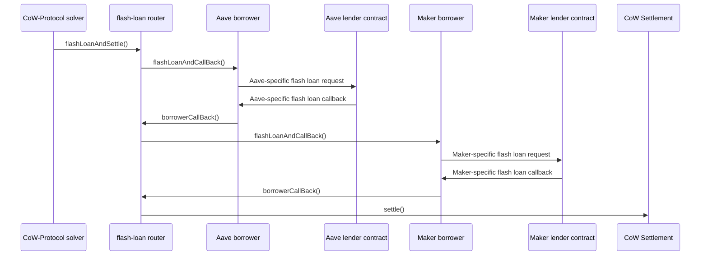

# Flash-Loan Router

A smart contract that allows CoW-Protocol solvers to execute a settlement with the ability to use funds from one or more flash loans.

# Ethereum addresses

The flash-loan router is introduced as part of the protocol with [CIP 66](https://snapshot.box/#/s:cow.eth/proposal/0x6f3d88347bcc8de87ecded2442c090d8eb1d3ef99eca75a831ee220ff5705f00).
All contracts are deployed deterministically with `CREATE2` and have the same address on all supported networks.

- FlashLoanRouter: `0x9da8B48441583a2b93e2eF8213aAD0EC0b392C69`
- AaveBorrower: `0x7d9C4DeE56933151Bc5C909cfe09DEf0d315CB4A`
- ERC3156Borrower: `0x47d71b4B3336AB2729436186C216955F3C27cD04`

See [networks.json](./networks.json) for details.


## Design

The flash-loan router lets a solver specify a list of flash-loan requests as well as a settlement to be executed with the proceeds of those loans.

Any registered CoW-Protocol solver can use this contract to execute settlements by proxy.

The entry point to the [router](src/FlashLoanRouter.sol) is the function `flashLoanAndSettle`.
It takes a list of loans with the following entries for each loan:

- The loaned amount and ERC-20 token.
- The flash-loan lender (e.g., Balancer, Aave, Maker, ...).
- The _borrower_, which is an adapter contract that makes the specific lender implementation compatible with the router.

It also takes the exact call data for a call to `settle`.
The flash-loan router is a solver for CoW Protocol and calls `settle` directly once the flash loans have been obtained.
Only CoW-Protocol solvers can call this function.
Solver authentication is done by interrogating the same contract that manages solver authentication for the settlement contract.

Tokens and lenders are external contracts, while the router and each specific borrowers are dedicated contract implemented in this repository.

The borrowers are the contracts that are called back by the lender once the flash loan is initiated; they are the contracts that receive the flash-loan proceeds and that are eventually responsible to repay the loan.

The only way to move funds out of a borrower is through an ERC-20 approval for some spender.
Approvals can be set by calling the `approve` function on the borrower from the context of a settlement.
For safe operations, like an approval for the settlement contract to spend the funds of the borrower, it's enough to set the approval once for an unlimited amount and reuse the same approval in future settlements.

At the start of the settlement, it's expected that the loaned funds are transferred from the borrowers to where they are needed. For example, this can be the settlement contract itself, or the address of a user who wants to use the loan to retrieve the collateral needed to avoid liquidations.
In general, solvers have full flexibility in deciding how loaned funds are allocated.

The settlement is also responsible for repaying the flash loans.
The specific repayment mechanism depends on the lender, but a common process is having the settlement contract send back the borrowed funds to the borrower and set an approval to the lender for spending the funds of the borrower: then the lender is going to pull back the funds with an ERC-20 `transferFrom` after the settlement is terminated.
Inability to pay for a flash loan will most likely be met by a reverting transaction.

We support the following flash-loan lenders:

- Any lender that is compatible with [ERC-3156](https://eips.ethereum.org/EIPS/eip-3156) interface (for example [Maker](https://docs.makerdao.com/smart-contract-modules/flash-mint-module)).
- [Aave](https://aave.com/docs/developers/flash-loans#overview).

Support for further flash-loan lenders can be added in the future.

This repository provides an abstract `Borrower` implementation that encodes much of the logic expected from a borrower.
Concrete borrower implementations can be built by inheriting this contract and implementing two functions: `triggerFlashLoan`, which describes how to call the lender to request a flash loan, and the lender-specific call-back function that internally forwards the call to `Borrower.flashLoanCallBack`.

### Example: a settlement with two loans, Aave and Maker

We describe an example of how to execute a settlement after borrowing two flash loans (from Aave and Maker) through the flash-loan router.

The following diagram is a simplified description of the expected calls in the execution process.
Each line is a call from the originating contract to the target contract.
Note that the call context is never given up in the diagram: each new call just increase the current call depth.
All calls are terminated at the end, after the settlement is executed.



The lenders are external contracts, not managed by this repository.

## Security model

### Router

The key security property of the router is that a solver is always in control of the data that is executed by the settlement contract.
The only way to execute a settlement through this contract is by having a registered solver call `flashLoanAndSettle` and including the exact settlement call data in the input to the call.

In particular, this means that:

- `flashLoanAndSettle` can only be called by a solver (that is not the router);
- a single call to `flashLoanAndSettle` leads to exactly one call to `settle`;
- the call to `settle` matches the data used in `flashLoanAndSettle`;

and this is also the case if any of the tokens, lenders, as well as borrowers involved are controlled by an adversary.

The flash-loan router also requests flash loans in the order they have been provided to `flashLoanAndSettle`.
Out-of-order execution eventually leads to a transaction revert.

A malicious party in the execution (token, lender, or borrower) is, however, able to disrupt the successful execution of a settlement by changing the chain state before the point of the `settle` call.
This could be either by triggering a revert or by exploiting the slippage tolerance in a solver's settlement.
This doesn't impact the security of user's funds but it increases the risks for solvers when relying on these contracts.
Assuming that the token, lender and borrower contracts are trusted, those risks should be comparable to the normal risks of executing a normal settlement.

### Borrowers

Borrowers don't have any special access to CoW Protocol nor to the router.
They are only used as an adapter for specific flash-loan lender implementations.

Unauthorized external access should not impair their ability to act as an adapter, nor it should modify the expected behavior of the contract.


## Usage

### Build

```shell
$ forge build
```

### Test

```shell
$ forge test
```

To exclude tests requiring an internet connection:

```shell
$ forge test --no-match-path 'test/e2e/**/*'
```

### Gas benchmarking

This repository includes benchmarking to estimate the gas cost of using the different flash-loan providers.
Benchmark results are generated automatically when running `forge test`.
The generated data can be found in the `snapshots/` folder.

### Format

```shell
$ forge fmt
```

### Deploy

For deploying on a new network, there are two steps:

1. [Deploy all contracts.](#deploy-all-contracts)
2. [Update the `networks.json` file.](#deployment-addresses)

For deploying new contracts on an existing network, the deployment [scripts](script) permit the deployment of a single contract or all contracts at once.
The networks.json file needs to be updated as linked above.

#### Environment setup

Copy the `.env.example` to `.env` and set the applicable configuration variables for the testing / deployment environment.


#### Deploy All Contracts

Deployment is handled by solidity scripts in `forge`. The network being deployed to is dependent on the `ETH_RPC_URL`.

To deploy all contracts in a single run, the [DeployAllContracts](script/DeployAllContracts.s.sol) script is used. This will run the deployments for FlashLoanRouter and Borrower contracts specified in the script.

```shell
source .env

# Dry-run the deployment
forge script script/DeployAllContracts.s.sol:DeployAllContracts --rpc-url $ETH_RPC_URL --private-key $PRIVATE_KEY 

# Broadcast the deployment
#   Don't forget to add the --verify flag
#   For Etherscan verification, ensure that the `ETHERSCAN_API_KEY` environment variable is set
forge script script/DeployAllContracts.s.sol:DeployAllContracts --rpc-url $ETH_RPC_URL --private-key $PRIVATE_KEY --broadcast --verify
```

For Etherscan verification, ensure that the `ETHERSCAN_API_KEY` environment variable is set and add the `--verify` flag to the `forge script` deployment commands.

#### Verification of deployed contracts
To verify an already deployed contract, you can use the `forge verify-contract` command.

```shell
# Verify FlashLoanRouter
forge verify-contract 0x9da8B48441583a2b93e2eF8213aAD0EC0b392C69 src/FlashLoanRouter.sol:FlashLoanRouter  --chain-id $CHAIN_ID --etherscan-api-key $ETHERSCAN_API_KEY --constructor-args $(cast abi-encode "constructor(address)" 0x9008D19f58AAbD9eD0D60971565AA8510560ab41)

# Verify AaveBorrower
forge verify-contract 0x7d9C4DeE56933151Bc5C909cfe09DEf0d315CB4A src/AaveBorrower.sol:AaveBorrower --chain-id $CHAIN_ID --etherscan-api-key $ETHERSCAN_API_KEY --constructor-args $(cast abi-encode "constructor(address)" 0x9da8B48441583a2b93e2eF8213aAD0EC0b392C69)

# Verify ERC3156Borrower
forge verify-contract 0x47d71b4B3336AB2729436186C216955F3C27cD04 src/ERC3156Borrower.sol:ERC3156Borrower --chain-id $CHAIN_ID --etherscan-api-key $ETHERSCAN_API_KEY --constructor-args $(cast abi-encode "constructor(address)" 0x9da8B48441583a2b93e2eF8213aAD0EC0b392C69)

```

#### Deploy a Single Contract

To deploy a single contract, the scripts within the [script/single-deployment](script/single-deployment) directory are used, e.g., to deploy the `FlashLoanRouter.sol` contract, the command below is used:

```shell
source .env

forge script script/single-deployment/DeployFlashLoanRouter.s.sol:DeployFlashLoanRouter --rpc-url $ETH_RPC_URL --private-key $PRIVATE_KEY --broadcast
```

#### Deployment addresses

The file [`networks.json`](./networks.json) lists all official deployments of the contracts in this repository by chain id.

This file is generated automatically using the broadcast files in the `broadcast/` directory.

Most of the deployments are done using the `forge` script as described in this README, however, some networks might be deployed in some other way (like replaying the creation code and constructor arguments). For these, we will need to manually update the file `broadcast/networks-manual.json`.

To regenerate the file after a new deployment, run the following command:

```sh
bash script/generate-networks-file.sh > networks.json
```
