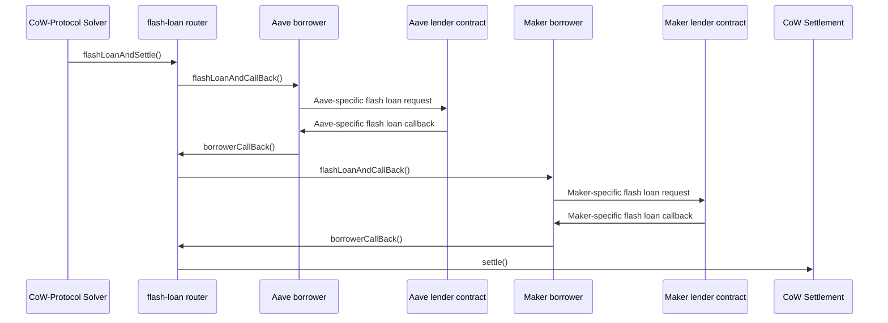

# Flash-Loan Router

A smart contract that allows CoW-Protocol solvers to execute a settlement with the ability to use funds from one or more flash loans.

## Design

The flash-loan router lets a solver specify a list of flash-loan requests as well as a settlement to be executed with the proceeds of those loans.

Any registered CoW-Protocol solver can use this contract to execute settlements by proxy.

The entry point to the router is the function `flashLoanAndSettle`.
It takes a list of loans with the following entries for each loan:

- The loaned amount and ERC-20 token.
- The flash-loan lender (e.g., Balancer, Aave, Maker, ...).
- The _borrower_, which is an adapter contract that makes the specific lender implementation compatible with the router.

It also takes the exact call data for a call to `settle`.
The flash-loan router is a solver for CoW Protocol and calls `settle` directly once the flash loans have been obtained.
Only CoW-Protocol solvers can call this function.
Solver authentication is done by interrogating the same contract that manages solver authentication for the settlement contract.

Tokens and lenders are external contracts, while the router and each specific borrowers are dedicated contract implemented in this repository.

The borrowers are the contracts that are called back by the lender once the flash loan is initiated; they are the contracts that receive the flash-loan proceeds and that are eventually responsible to repay the loan.

The only way to move funds out of a borrower is through an ERC-20 approval for some spender.
Approvals can be set by calling the `approve` function on the borrower from the context of a settlement.
For safe operations, like an approval for the settlement contract to spend the funds of the borrower, it's enough to set the approval once for an unlimited amount and reuse the same approval in future settlements.

At the start of the settlement, it's expected that the loaned funds are transferred from the borrowers to where they are needed. For example, this can be the settlement contract itself, or the address of a user who wants to use the loan to retrieve the collateral needed to avoid liquidations.
In general, solvers have full flexibility in deciding how loaned funds are allocated.

The settlement is also reponsible for repaying the flash loans.
The specific repayment mechanism depends on the lender, but a common process is having the settlement contract send back the borrowed funds to the borrower and set an approval to the lender for spending the funds of the borrower: then the lender is going to pull back the funds with an ERC-20 `transferFrom` after the settlement is terminated.
Inability to pay for a flash loan will most likely be met by a reverting transaction.

We support the following flash-loan lenders:

- Any lender that is compatible with [ERC-3156](https://eips.ethereum.org/EIPS/eip-3156) interface (for example [Maker](https://docs.makerdao.com/smart-contract-modules/flash-mint-module)).
- [Aave](https://aave.com/docs/developers/flash-loans#overview).

Support for further flash-loan lenders can be added in the future.

This repository provides an abstract `Borrower` implementation that encodes much of the logic expected from a borrower.
Concrete borrower implementations can be built by inheriting this contract and implementing two functions: `triggerFlashLoan`, which describes how to call the lender to request a flash loan, and the lender-specific call-back function that internallly forwards the call to `Borrower.flashLoanCallBack`.

### Example: a settlement with two loans, Aave and Maker

We describe an example of how to execute a settlement after borrowing two flash loans (from Aave and Maker) through the flash-loan router.

The following diagram is a simplified description of the expected calls in the execution process.
Each line is a call from the originating contract to the target contract.
Note that the call context is never given up in the diagram: each new call just increase the current call depth.
All calls are terminated at the end, after the settlement is executed.



The lenders are external contracts, not managed by this repository.

## Security model

### Router

The key security property of the router is that a solver is always in control of the data that is executed by the settlement contract.
The only way to execute a settlement through this contract is by having a registered solver call `flashLoanAndSettle` and including the exact settlement call data in the input to the call.

In particular, this means that:

- `flashLoanAndSettle` can only be called by a solver (that is not the router);
- a single call to `flashLoanAndSettle` leads to exactly one call to `settle`;
- the call to `settle` matches the data used in `flashLoanAndSettle`;

and this is also the case if any of the tokens, lenders, as well as borrowers involved are controlled by an adversary.

The flash-loan router also requests flash loans in the order they have been provided to `flashLoanAndSettle`.
Out-of-order execution eventually leads to a transaction revert.

A malicious party in the execution (token, lender, or borrower) is, however, able to disrupt the successful execution of a settlement by changing the chain state before the point of the `settle` call.
This could be either by triggering a revert or by exploiting the slippage tolerance in a solver's settlement.
This doesn't impact the security of user's funds but it increases the risks for solvers when relying on these contracts.
Assuming that the token, lender and borrower contracts are trusted, those risks should be comparable to the normal risks of executing a normal settlement.

### Borrowers

Borrowers don't have any special access to CoW Protocol nor to the router.
They are only used as an adapter for specific flash-loan lender implementations.

Unauthorized external access should not impair their ability to act as an adapter, nor it should modify the expected behavior of the contract.


## Usage

### Build

```shell
$ forge build
```

### Test

```shell
$ forge test
```

To exclude tests requiring an internet connection:

```shell
$ forge test --no-match-path 'test/e2e/**/*'
```

### Gas benchmarking

This repository includes benchmarking to estimate the gas cost of using the different flash-loan providers.
Benchmark results are generated automatically when running `forge test`.
The generated data can be found in the `snapshots/` folder.

### Format

```shell
$ forge fmt
```

### Deploy

```shell
$ forge script script/Counter.s.sol:CounterScript --rpc-url <your_rpc_url> --private-key <your_private_key>
```
